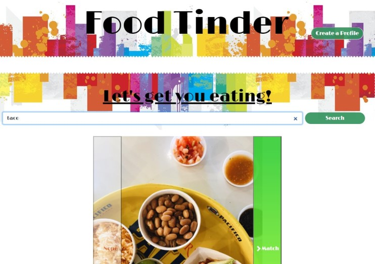
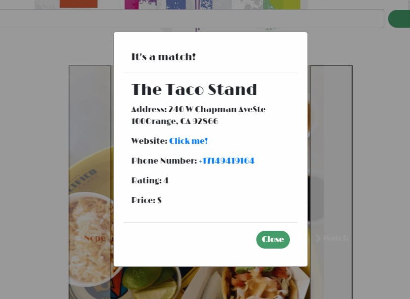

# TinderForFood

## Description:
There are days when we have limited time and even less patience, and the last decision you want to make is the dreaded, "What should we have for dinner?"  This application helps resolve this issue by simplifying the process and the final decision making.  With just a few swipes left or right, we can narrow down our choices that fit our tastes in that very moment.

## Process of Development
1. Created HTML, CSS, JS files, and linked them to out index file.
2. Researched and linked various API's: Bootstrap, jQuery, Google Fonts.
7. Researched API's to obtain information on local restaurants through the Yelp API.
8. Added functions to get the location of the user's browser.
9. Created available tags to search bar for auto-fill and streamline functionality.
10. Added profile button and created a modal for out input.
11. Added local storage for user profile.
12. Inserted addEventListeners to all buttons, and linked our git fetch functions.
13. CSS styling issues - visual, functional. 

## Deployment

https://chrischo94.github.io/TinderForFood/  
https://github.com/chrischo94/TinderForFood.git

